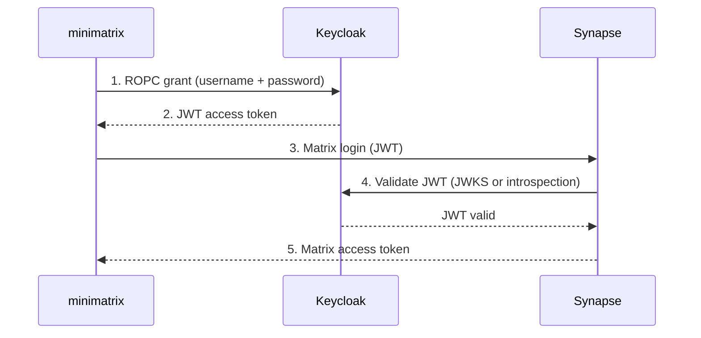

[](https://github.com/vroomfondel/minimatrix/actions/workflows/checkblack.yml)
[](https://github.com/vroomfondel/minimatrix/actions/workflows/mypynpytests.yml)
[](https://github.com/vroomfondel/minimatrix/actions/workflows/buildmultiarchandpush.yml)
[](https://github.com/vroomfondel/minimatrix)
[](https://hub.docker.com/r/xomoxcc/minimatrix/tags)
[](https://pepy.tech/projects/minimatrix)
[](https://pypi.org/project/minimatrix/)

[](https://hub.docker.com/r/xomoxcc/minimatrix/tags)

# minimatrix

Standalone Matrix CLI client with E2E encryption. Send messages, listen to rooms,
and list joined rooms — all from the command line.

## Status

**Beta (v0.0.1)** — core CLI with E2E encryption, password/SSO/JWT authentication,
and basic room operations are implemented.

## Features

- **Send** encrypted messages to Matrix rooms
- **Listen** for incoming messages in real-time (prints to stdout)
- **List** joined rooms with display names and member counts
- **Manage invites** — list pending invitations (with inviter, type, timestamp) and accept individually
- **Auto-join** — optionally accept all pending room invitations on startup (`--auto-join`)
- **Session caching** — persists Matrix access tokens to avoid re-authentication on every run
- **E2E encryption** via matrix-nio with persistent crypto store and device reuse
- **TOFU device trust** — automatically trusts all devices in a room
- **Multiple auth methods**: password, SSO, or JWT via Keycloak (ROPC + JWKS)
- **Flexible config**: YAML file, environment variables, and CLI args (in ascending priority)
- Structured logging via loguru

## Installation

### From PyPI

```bash
pip install minimatrix
```

### From source

```bash
git clone https://github.com/vroomfondel/minimatrix.git
cd minimatrix
make venv
source .venv/bin/activate
pip install .
```

### Docker

```bash
docker build -t minimatrix .
```

## Quick Start

### 1. Create a config file (optional)

```yaml
# ~/.config/minimatrix/config.yaml
homeserver: "https://matrix.example.com"
user: "myuser"
password: "mypassword"
```

### 2. List joined rooms and pending invites

```bash
minimatrix rooms
```

### 3. Manage invitations

```bash
# List pending invites
minimatrix invites
minimatrix invites list

# Accept a specific invite
minimatrix invites accept --room '!abc123:example.com'
```

### 4. Send a message

```bash
minimatrix send --room '!abc123:example.com' "Hello from minimatrix!"

# Or pipe from stdin
echo "Hello from a pipe" | minimatrix send --room '!abc123:example.com'
```

### 5. Listen for messages

```bash
minimatrix listen --room '!abc123:example.com'
# [2026-02-22 14:30:01] <@alice:example.com> Hi there!
# Press Ctrl+C to stop
```

## Configuration

Configuration is resolved in this order (later overrides earlier):

1. **YAML config file** (`~/.config/minimatrix/config.yaml` by default)
2. **Environment variables**
3. **CLI arguments**

### General Options

| Variable / Config Key | CLI Argument | Default |
|---|---|---|
| `MATRIX_HOMESERVER` / `homeserver` | `--homeserver` | `http://synapse.matrix.svc.cluster.local:8008` |
| `MATRIX_USER` / `user` | `--user` | — (**required**) |
| `MATRIX_PASSWORD` / `password` | `--password` | — (**required**) |
| `CRYPTO_STORE_PATH` / `crypto_store_path` | `--crypto-store-path` | `~/.local/share/minimatrix/crypto_store` |
| `AUTH_METHOD` / `auth_method` | `--auth-method` | `password` |
| `AUTO_JOIN` / `auto_join` | `--auto-join` | `false` |
| `LOGURU_LEVEL` | — | `DEBUG` |

### CLI Subcommands

| Subcommand | Description |
|---|---|
| `rooms` | List joined rooms and pending invites |
| `invites [list]` | List pending room invitations (with inviter, DM/Room type, timestamp) |
| `invites accept --room ROOM_ID` | Accept a specific room invitation |
| `send --room ROOM_ID [MESSAGE]` | Send a text message (reads from stdin if message omitted) |
| `listen --room ROOM_ID` | Listen for messages and print to stdout |

Use `minimatrix --help` or `minimatrix <subcommand> --help` for full usage.

## JWT Authentication

When `AUTH_METHOD=jwt` is set, minimatrix authenticates via Keycloak ROPC (Resource Owner Password Credentials) grant instead of direct Matrix password login. This enables centralized identity management through Keycloak while allowing non-interactive authentication.

### Authentication Flow



### Supported Login Types

| Login Type | Synapse Config | Validation Method | Use Case |
|---|---|---|---|
| `com.famedly.login.token.oauth` (default) | synapse-token-authenticator `oauth:` | JWKS endpoint | **Recommended** — automatic key rotation |
| `com.famedly.login.token` | synapse-token-authenticator `jwt:` | Symmetric secret (HS512) | Internal services with shared secret |
| `org.matrix.login.jwt` | Native `jwt_config:` | Public key (RS256) | Simple setup, manual key management |

### JWT Environment Variables

| Variable / Config Key | CLI Argument | Default |
|---|---|---|
| `AUTH_METHOD` / `auth_method` | `--auth-method` | `password` |
| `KEYCLOAK_URL` / `keycloak_url` | `--keycloak-url` | — (required if jwt) |
| `KEYCLOAK_REALM` / `keycloak_realm` | `--keycloak-realm` | — (required if jwt) |
| `KEYCLOAK_CLIENT_ID` / `keycloak_client_id` | `--keycloak-client-id` | — (required if jwt) |
| `KEYCLOAK_CLIENT_SECRET` / `keycloak_client_secret` | `--keycloak-client-secret` | `""` (empty for public clients) |
| `JWT_LOGIN_TYPE` / `jwt_login_type` | `--jwt-login-type` | `com.famedly.login.token.oauth` |

Requires [synapse-token-authenticator](https://github.com/famedly/synapse-token-authenticator) on the Synapse side for the `com.famedly.login.token.*` login types.

## Synapse Setup for JWT Authentication

### Prerequisites

- Keycloak instance (any recent version)
- Synapse homeserver
- Admin access to both Keycloak and Synapse

### Step 1: Keycloak Realm Setup

Create a dedicated realm for Matrix (or use an existing one).

**Recommended realm settings:**
- `registrationAllowed: false` — disable self-registration
- `loginWithEmailAllowed: false` — use usernames, not emails (Matrix localparts)
- `registrationEmailAsUsername: false` — important for Matrix username compatibility

### Step 2: Create OAuth Client

Create a **confidential client** with ROPC (Direct Access Grants) enabled:

| Setting | Value | Reason |
|---|---|---|
| `publicClient` | `false` | Confidential client with secret |
| `clientAuthenticatorType` | `client-secret` | Use client secret for auth |
| `directAccessGrantsEnabled` | `true` | **Required** — enables ROPC grant |
| `standardFlowEnabled` | `false` | No browser redirects needed |
| `serviceAccountsEnabled` | `false` | Not using service account |

After creation, copy the **Client secret** from the **Credentials** tab.

### Step 3: Create User in Keycloak

Create a user account in your Keycloak realm. The Keycloak username must match the desired Matrix localpart — Synapse extracts it from the `preferred_username` JWT claim.

### Step 4: Configure Synapse

#### Option A: OAuth with JWKS Validation (Recommended)

```yaml
modules:
  - module: synapse_token_authenticator.TokenAuthenticator
    config:
      oauth:
        jwt_validation:
          jwks_endpoint: "https://keycloak.example.com/realms/<realm>/protocol/openid-connect/certs"
          localpart_path: "preferred_username"
          require_expiry: true
          validator:
            type: exist
        registration_enabled: true
```

#### Option B: JWT with Symmetric Secret

```yaml
modules:
  - module: synapse_token_authenticator.TokenAuthenticator
    config:
      jwt:
        secret: "your-256-bit-secret-here"
        algorithm: HS512
        allow_registration: false
        require_expiry: true
```

#### Option C: Native Synapse JWT (No Module Required)

```bash
# Get the realm public key
curl -s "https://keycloak.example.com/realms/<realm>" | jq -r '.public_key'
```

```yaml
jwt_config:
  enabled: true
  secret: |
    -----BEGIN PUBLIC KEY-----
    <paste the public key here>
    -----END PUBLIC KEY-----
  algorithm: "RS256"
  subject_claim: "preferred_username"
  issuer: "https://keycloak.example.com/realms/<realm>"
```

### Login Type Comparison

| Feature | `com.famedly.login.token.oauth` | `com.famedly.login.token` | `org.matrix.login.jwt` |
|---|---|---|---|
| Key management | Automatic (JWKS) | Manual (shared secret) | Manual (public key) |
| Key rotation | Automatic | Manual secret update | Manual config update |
| Algorithm | RS256 (asymmetric) | HS512 (symmetric) | RS256 (asymmetric) |
| Module required | Yes | Yes | No |
| **Recommended for** | **Production** | Internal services | Simple setups |

## Troubleshooting

**"Invalid username or password" from Synapse:**
- Verify the Keycloak user exists and password is correct
- Check that `preferred_username` in JWT matches an existing Matrix user (or `registration_enabled: true`)
- Verify JWKS endpoint is accessible from Synapse

**"ROPC grant failed" from Keycloak:**
- Ensure `directAccessGrantsEnabled: true` on the client
- Verify client secret is correct
- Check user is enabled in Keycloak

**"JWT signature validation failed":**
- For JWKS: verify the endpoint URL is correct and accessible
- 
- For native JWT: ensure public key is correctly formatted with PEM headers
- Check `issuer` matches the JWT `iss` claim

### Useful Keycloak Endpoints

| Endpoint | Purpose |
|---|---|
| `/realms/<realm>/.well-known/openid-configuration` | OIDC discovery document |
| `/realms/<realm>/protocol/openid-connect/certs` | JWKS endpoint (public keys) |
| `/realms/<realm>/protocol/openid-connect/token` | Token endpoint (ROPC) |
| `/realms/<realm>` | Realm info (includes public key) |

## Development

| Target | Description |
|---|---|
| `make venv` | Create virtualenv and install all dependencies |
| `make tests` | Run pytest |
| `make lint` | Format code with black (line length 120) |
| `make isort` | Sort imports with isort |
| `make tcheck` | Static type checking with mypy (strict) |
| `make commit-checks` | Run pre-commit hooks on all files |
| `make prepare` | Run tests + commit-checks |
| `make pypibuild` | Build sdist + wheel with hatch |
| `make pypipush` | Publish to PyPI with hatch |

## License
This project is licensed under the LGPL where applicable/possible — see [LICENSE.md](LICENSE.md). Some files/parts may use other licenses: [MIT](LICENSEMIT.md) | [GPL](LICENSEGPL.md) | [LGPL](LICENSELGPL.md). Always check per‑file headers/comments.


## Authors
- Repo owner (primary author)
- Additional attributions are noted inline in code comments


## Acknowledgments
- Inspirations and snippets are referenced in code comments where appropriate.


## ⚠️ Note

This is a development/experimental project. For production use, review security settings, customize configurations, and test thoroughly in your environment. Provided "as is" without warranty of any kind, express or implied, including but not limited to the warranties of merchantability, fitness for a particular purpose and noninfringement. In no event shall the authors or copyright holders be liable for any claim, damages or other liability, whether in an action of contract, tort or otherwise, arising from, out of or in connection with the software or the use or other dealings in the software. Use at your own risk.
